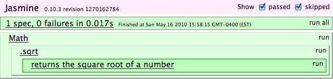

# 2010.11.16 Jasmine @ Sencha Conf

!SLIDE middle small

## Introduction to Jasmine

### BDD for JavaScript

#### [Davis W. Frank](mailto:dwfrank@pivotallabs.com) | [Pivotal Labs](http://pivotallabs.com) | [@dwfrank](http://twitter.com/dwfrank)

!SLIDE middle

# TATFT

!SLIDE full-background

}}} images/tdd.png

!SLIDE middle

# What about JavaScript?

!SLIDE middle

# <em>UT</em>&nbsp;YJSATFT

!SLIDE

<blockquote class="twitter-bubble" cite="http://twitter.com/#!/tom_b025/status/29591504502">
  

	Practising whilst testing with <a href="http://twitter.com/jasminebdd">@JasmineBDD</a> has improved my knowledge of JavaScript over the last few days.
  

</blockquote>

  <a href="http://twitter.com/tom_b025">@tom_b025</a>
  on
  <a href="http://twitter.com/#!/tom_b025/status/29591504502">03 Nov 2010</a>

!SLIDE

<blockquote class="twitter-bubble" cite="http://twitter.com/#!/coreyhaines/status/28007443308">
  

    Using <a href="http://twitter.com/jasminebdd">@JasmineBDD</a> for testing JavaScript significantly speeds up the process/runtime. <a href="#">#rar10</a>
  

</blockquote>

  <a href="http://twitter.com/coreyhaines">@coreyhaines</a>
  on
  <a href="http://twitter.com/#!/coreyhaines/status/28007443308">21 Oct 2010</a>

!SLIDE

<blockquote class="twitter-bubble" cite="http://twitter.com/#!/nathanstults/status/29600748032">
  

    I've never bothered to test my JavaScript before now. It feels fantastic and <a href="http://twitter.com/jasminebdd">@JasmineBDD</a> flows like water. Very nice stuff.
 

</blockquote>

  <a href="http://twitter.com/NathanStults">@NathanStults</a>
  on
  <a href="http://twitter.com/#!/nathanstults/status/29600748032">03 Nov 2010</a>

!SLIDE

@@@ js
describe("Math", function() {
  describe(".sqrt", function() {
    it("returns the square root of a number", function() {
      expect(Math.sqrt(64)).toEqual(8);
    });
  });
});
@@@
    
!SLIDE middle
       
 

!SLIDE

# As a site administrator

 
# I want to obfuscate offensive language

# So that I don't risk offending my users

!SLIDE middle

# Expectations

!SLIDE

@@@ js
describe("String", function() {
  describe(".cleanUp", function() {
    it("replaces restricted words with four asterisks", function() {
      filterWords = ["golly", "heck"];
      dirtyString = "Golly! What the heck?";
      cleanString = dirtyString.cleanUp(filterWords);
      expect(cleanString).toEqual("****! What the ****?");
    });
  });    
});
@@@

!SLIDE middle

 

!SLIDE

@@@ js
String.prototype.cleanUp = function (filterWords) {
  var pattern = filterWords.join("|"),
  regExp  = new RegExp(pattern, "mig");
  return this.replace(regExp, "****");
};
@@@

!SLIDE middle

 

!SLIDE

# Matchers

@@@ js
expect(cleanString).toEqual("****! What the ****?"); 
expect(cleanString).toMatch(new RegExp("\\*{3}")); 
expect(cleanString).toBeDefined(); 
expect(cleanString).not.toBeNull();
expect(cleanString).toBeTruthy();
expect(cleanString).not.toBeFalsy();
expect(cleanString).not.toContain("golly");
@@@

!SLIDE

# Custom Matchers

@@@ js
// top-level beforeEach() call is made before every spec
beforeEach(function() {
  this.addMatchers({
    toBeCleanedUp: function() {
      return this.actual.cleanUp(filterWords) !== this.actual;
    }
  });
});
@@@

!SLIDE

@@@ js
describe(".cleanUp", function() {
  beforeEach(function() {
    filterWords = ["justin", "bieber"];  
  });
      
  it("replaces restricted words with three asterisks", function() {
    expect("Justin Bieber: My World").toBeCleanedUp();
  });

  it("returns strings without restricted language unmodified", function() {
    expect("Metric: Fantasies").not.toBeCleanedUp();
  });
});    
@@@

!SLIDE middle

 

!SLIDE middle

# Spies

!SLIDE

@@@ js
describe(".getTrends", function() {
  it("requests current trends from Twitter's search API", function() {
    spyOn(jQuery, "getJSON")
        
    twitterApi = new TwitterApi();
    twitterApi.getTrends();
        
    expect(jQuery.getJSON).toHaveBeenCalledWith(
      "http://search.twitter.com/trends.json?callback=?", 
      jasmine.any(Function)
    );
  });
});
@@@

!SLIDE middle

 

!SLIDE

@@@ js
function TwitterApi() {
  this.trendsUrl = "http://search.twitter.com/trends.json?callback=?"
}

TwitterApi.prototype = {
  getTrends: function() {
    jQuery.getJSON(this.trendsUrl, function(data, textStatus) {});
  }
};
@@@

!SLIDE middle

 

!SLIDE

@@@ js
mockResponse = {
  as_of: "2010-11-07 19:21",
  trends: [
    {name: "NYC Marathon", url: "http://fake.url/nyc-marathon"},
    {name: "Laphroaig", url: "http://fake.url/laphroaig"},
    {name: "Verizon iPad", url: "http://fake.url/vzw-ipad"},
    {name: "A380 Emergency", url: "http://fake.url/a380-emergency"},
    {name: "SF Giants", url: "http://fake.url/sfgiants-world-series"}                
  ]
};
@@@

!SLIDE

@@@ js
describe("TwitterApi", function() {
  it("responds with an array of current trends", function() {
    spyOn(jQuery, "getJSON")
       
    twitterApi = new TwitterApi();

    var trends = [];
    twitterApi.getTrends(function(response) { 
      trends = response; 
    });

    jQuery.getJSON.mostRecentCall.args[1](mockResponse);
    expect(trends.length).toEqual(5);
    expect(trends[1]['name']).toEqual('Clojure');
  });
});
@@@

!SLIDE middle

 

!SLIDE

@@@ js
TwitterApi.prototype = {
  getTrends: function(callback) {
    jQuery.getJSON(this.trendsUrl, function(data, textStatus) {
      callback(data["trends"]);
    });
  }
};
@@@

!SLIDE middle

 

!SLIDE

# Spy Matchers

@@@ js
spyOn(jQuery, "getJSON");

expect(jQuery.getJSON).toHaveBeenCalled();
expect(jQuery.getJSON).toHaveBeenCalledWith("http://example.com/service.json");
@@@

!SLIDE

# Spy Definitions

@@@ js
spyOn(Math, "sqrt").andCallThrough(); // Calls the original function
spyOn(Math, "sqrt").andReturn(42); // Return 42
spyOn(Math, "sqrt").andThrow("Exception"); // Throws an exception
spyOn(Math, "sqrt").andCallFake(function(arg) { 
  return arg * Math.random(); 
}); // Substitute with fake anonymous function
@@@

!SLIDE 

# Spy Properties

@@@ js
spyOn(jQuery, "getJSON");
  
jQuery.getJSON.callCount; // Number of calls to spy
jQuery.getJSON.mostRecentCall.args; // Arguments for most recent call to the spy
jQuery.getJSON.argsForCall[1]; // Arguments for a specific call to the spy
@@@

!SLIDE middle

#DOM Fixtures and jQuery

!SLIDE

@@@ js
describe("TwitterApi", function() {
  beforeEach(function() { 
    jQuery('
').appendTo("#jasmine_content"); 
  });

  afterEach(function() { jQuery("#trends").remove(); });    
  
  describe(".updateTrends", function() {
    it("builds a link for each trend and attaches it to #trends", function() {
      twitterApi = new TwitterApi();
      twitterApi.updateTrends(mockResponse.trends);
      href = jQuery('#trends li a:contains(iPad)').attr('href');
      expect(href).toEqual('http://fake.url/ipad');
    });
  });
});
@@@

!SLIDE

@@@ js
TwitterApi.prototype = {
  updateTrends: function(trends) {
    jQuery.each(trends, function(i, trend) {
      li = jQuery("<li />");

      jQuery("<a />")
        .attr("href", trend.url)
        .attr("target", "_blank")
        .html(trend.name)
        .appendTo(li);

      li.appendTo("#trends");
    });
  }
}
@@@

!SLIDE middle

 

!SLIDE middle

!SLIDE middle

# How?

!SLIDE

# Jasmine 

@@@ html
<script type="text/javascript" src="jasmine.js" />
@@@

!SLIDE

# Well, really it's:

<pre>
&lt;!DOCTYPE HTML&gt;
	&lt;html&gt;
	&lt;head&gt;
	  &lt;title&gt;Jasmine Test Runner&lt;/title&gt;
	  &lt;link rel=&quot;stylesheet&quot; type=&quot;text/css&quot; href=&quot;jasmine.css&quot; /&gt;
	  &lt;script type=&quot;text/javascript&quot; src=&quot;jasmine.js&quot;&gt;&lt;/script&gt;
	  &lt;script type=&quot;text/javascript&quot; src=&quot;jasmine-html.js&quot;&gt;&lt;/script&gt;

	  &lt;!-- include source files here... --&gt;
	  &lt;script type=&quot;text/javascript&quot; src=&quot;src/Player.js&quot;&gt;&lt;/script&gt;
	  &lt;script type=&quot;text/javascript&quot; src=&quot;src/Song.js&quot;&gt;&lt;/script&gt;

	  &lt;!-- include spec files here... --&gt;
	  &lt;script type=&quot;text/javascript&quot; src=&quot;spec/SpecHelper.js&quot;&gt;&lt;/script&gt;
	  &lt;script type=&quot;text/javascript&quot; src=&quot;spec/PlayerSpec.js&quot;&gt;&lt;/script&gt;
	&lt;/head&gt;
	&lt;body&gt;
	&lt;script type=&quot;text/javascript&quot;&gt;
	  jasmine.getEnv().addReporter(new jasmine.TrivialReporter());
	  jasmine.getEnv().execute();
	&lt;/script&gt;
	&lt;/body&gt;
	&lt;/html&gt;
</pre>

!SLIDE

# Jasmine Gem

## Test without thinking

For projects where Ruby is (at least) welcome

@@@ sh
$ gem install jasmine
$ mkdir app
$ jasmine init
$ rake jasmine
   your tests are here: http://localhost:8888/
@@@

 

!SLIDE bulleted

# Continuous Integration

@@@ sh
$ rake jasmine:ci
@@@

* Runs your specs in a browser (Selenium)
* Reports via command line (RSpec)
* Works with your CI server (CCRB, Hudson, Team City)

!SLIDE middle

# What about Sencha?

!SLIDE middle

# Read Michael Feathers's [_The Humble Dialog Box_](http://www.objectmentor.com/resources/articles/TheHumbleDialogBox.pdf)

!SLIDE middle

# Test-drive code that implements your business logic

!SLIDE middle

# Let Sencha test the framework

!SLIDE middle

# Jasmine is lousy at integration tests

!SLIDE

1. Test drive ___your___ value
1. Don't test the framework
1. Test your app

!SLIDE bulleted

# Support

  * Homepage: [http://pivotal.github.com/jasmine](http://pivotal.github.com/jasmine)
  * Blog: [http://jasmine.pivotallabs.com/blog](http://jasmine.pivotallabs.com/blog	)
  * Twitter: [@jasminebdd](http://twitter.com/jasminebdd)
  * Mailing List: [http://groups.google.com/group/jasmine-js](http://groups.google.com/group/jasmine-js)
  * Issues: [http://github.com/pivotal/jasmine/issues](http://github.com/pivotal/jasmine/issues)
  * Backlog: [http://pivotaltracker.com/projects/](http://pivotaltracker.com/projects/)

 

# Contribute

  * [http://github.com/pivotal/jasmine](http://github.com/pivotal/jasmine)
  * [http://github.com/pivotal/jasmine-gem](http://github.com/pivotal/jasmine-gem)
  * [http://groups.google.com/group/jasmine-js-dev](http://github.com/pivotal/jasmine-gem)

!SLIDE middle thanks

# Thanks

 expect(jasmine).toBeDefined();

#### [@jasminedbdd](http://twitter.com/jasminebdd)